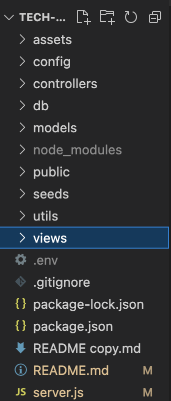
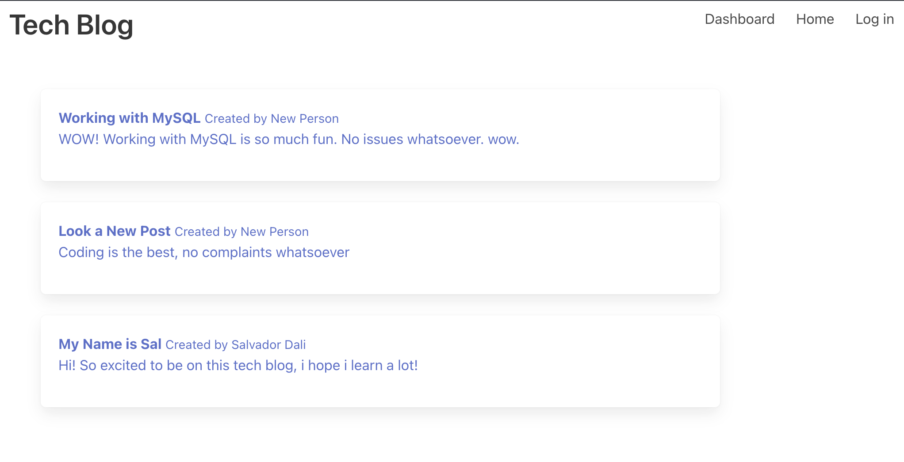

# Tech-Blog-MVC

 **What does this application do and why?**

* Allows users to post blogs about their tech experiences and shares them with other users. 
* Allows you to create and view your own profile

**How the application is organized**
The Tech Blog is organized in the following files:

**Step-by-Step on how to run the application**
* Log In or sign up on the homepage
* Click on the dashboard to view all blog posts
* Click on a singular blog post to view it and comment
* Click "Home" to view profile with your own blog posts
* Click "New Post" to add a blog post
* Click "Update" or "Delete" to update or delete own post
* Click Log out to log out of profile!
**What the application looks like**
This is what the homepage looks like!

And here's a screencastify of it:

https://watch.screencastify.com/v/KtH7gN3ujL8lMQiLxOJ5

**Link to deployed version of Pawsome Petfinder**

Website: https://thawing-sea-73401.herokuapp.com/
GitHub Repository: https://github.com/echandlerdavis/Tech-Blog-MVC

**Technologies Used** 

* html
* css
* javascript
* Bulma
* MySQL
* sequelize

